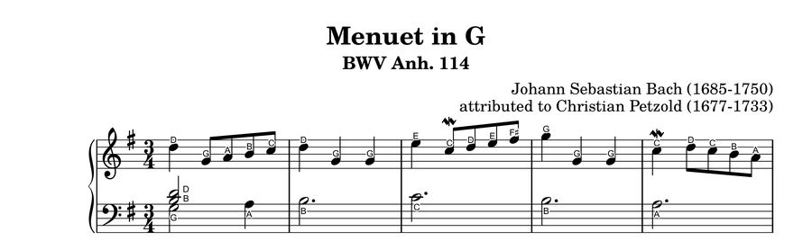

# Music Sheet Note Name Annotator

Takes a **piano sheet-music PDF**, reads the notes with optical music recognition
(OMR), and produces a copy of the **original** PDF with the letter name of every
note printed on top of it — `B♭`, `C♯`, `D♭`, `G♭`, … — stacked vertically when
several notes sound together in one beat (chords). The original sheet music is
left untouched; only the labels are overlaid.

```
input.pdf  ──►  input (annotated).pdf
```

The web UI adds a **Play** page on top of that: the annotated sheet above an
88-key keyboard, playing the piece back with the keys lit up as it goes -
blue for the right hand, green for the left - and a dashed playhead stepping
through the notes on the sheet.



*Excerpt from "Menuet in G" (BWV Anh. 114), public-domain edition from the
[Mutopia Project](https://www.mutopiaproject.org/), annotated by this tool.*

---

## The concept

Learning to read music is hard partly because a note's position on the staff must
be mentally converted into a pitch name. This app automates that conversion and
prints the answer right where you need it:

- one label per note, directly **above** the notehead for the right-hand /
  treble staff and **below** it for the left-hand / bass staff;
- simultaneous notes (chords, and same-beat notes across voices) are **stacked
  vertically**, highest pitch furthest from the staff;
- labels use Unicode accidentals by default (`B♭`, `C♯`, `D♭`) or ASCII
  (`Bb`, `C#`, `Db`), optionally with the octave number appended (`B♭4`).

The result is the same sheet you already have — same engraving, same layout —
with training wheels added.

---

## How it works

The pipeline has three stages:

```
PDF input
   │
   │  (1) Audiveris OMR  —  Audiveris.exe -batch -export
   ▼
book.mxl   MusicXML  (not used for the labels; it is the only source of
           note DURATIONS, which the .omr never decodes - see the Play page)
book.omr   Audiveris's own recognition data — a zip of per-page XML containing,
           for every recognized notehead: the EXACT pixel bounding box, the staff
           it belongs to, and Audiveris's own diatonic pitch
   │
   │  (2) Labeling — per notehead: correct pitch = Audiveris pitch, converted
   │      through the ACTUAL clef at that position (read from the PDF's own clef
   │      glyphs) + the key signature + any explicit accidentals
   ▼
per-note (x, y) positions in the PDF's own pixel space, plus the label text
   │
   │  (3) Rendering — PyMuPDF overlay onto the untouched original vector PDF
   ▼
output.pdf
```

A fourth, optional stage runs alongside it for the Play page: `timeline.py`
joins the rhythm read out of `book.mxl` (`musicxml.py`) with the notehead and
barline geometry already read out of `book.omr`, producing a JSON file of
what sounds when and where it sits on the page. It is best-effort — if it
fails, the annotated PDF is still produced and only playback is unavailable.


---

## Requirements

- **Windows** (the Audiveris build and the font path are Windows-specific).
- **Python 3.12** with a virtual environment.
- [**Audiveris**](https://github.com/Audiveris/audiveris) **5.11** (Windows build), already bundled at
  `tools/Audiveris/Audiveris/Audiveris.exe` — its runtime/JRE is included, so
  no separate Java installation is needed.
- **Arial Unicode MS** (`C:\Windows\Fonts\arialuni.ttf`), present by default on
  Windows.

---

## Setup

### 0. Get Audiveris (if `tools/Audiveris/` isn't already there)

It's gitignored (AGPL-3.0, ~166MB — see [License](#license)), so a fresh clone
needs it added manually, once:

1. Download **`Audiveris-5.11.0-windows-x86_64.msi`** from the
   [5.11.0 release](https://github.com/Audiveris/audiveris/releases/tag/5.11.0)
   on [Audiveris's GitHub](https://github.com/Audiveris/audiveris).
2. Run the installer (default install location is typically
   `C:\Program Files\Audiveris\`).
3. Copy that installed folder into this repo as `tools/Audiveris/Audiveris/`,
   so `tools/Audiveris/Audiveris/Audiveris.exe` exists. The installer isn't
   needed system-wide afterward — only this copied folder is actually used —
   so feel free to uninstall it from Windows once it's copied.

### 1. Python environment

```powershell
# Create the virtual environment (once)
python -m venv .venv

# Install dependencies
.venv\Scripts\python.exe -m pip install music21 pymupdf
```

The project's `.venv` also contains numpy/opencv-python-headless from an earlier
revision of the plan, but the shipped pipeline only needs **PyMuPDF** at runtime
(music21 is no longer used).

> Note: keep these packages inside `.venv` — do not install them into a shared
> base environment (an earlier misstep forced a numpy downgrade there).

---

## Usage

```powershell
.venv\Scripts\python.exe run.py <input.pdf> [options]
```

Options:

| Option | Default | Meaning |
|---|---|---|
| `-o, --output` | `<input stem> (annotated).pdf` | Output PDF path |
| `--style unicode\|ascii` | `unicode` | `B♭`/`C♯` vs `Bb`/`C#` |
| `--octave` | off | Append the octave number (`B♭4`) |
| `--font-size N` | `6.5` | Label font size in points |
| `--work-dir DIR` | `output` | Where intermediate Audiveris files go |

Example:

```powershell
.venv\Scripts\python.exe run.py "your-music-sheet.pdf"
# -> "your-music-sheet(annotated).pdf"  (+ output/*.mxl, *.omr)
```

Intermediate Audiveris output (`.mxl`, `.omr`, and Audiveris's own log) lands in
`output/`. Rerunning overwrites it.

If Audiveris has already been run and you only want to re-do the labeling and
rendering, `annotate.py` can run standalone:

```powershell
.venv\Scripts\python.exe annotate.py input.pdf --omr output\book.omr
```

---

## Web UI

`server.py` wraps the same pipeline behind a small REST API and serves a
browser UI (`static/index.html`) alongside it, for uploading a PDF/photo and
downloading the annotated result without touching the command line.

### Starting it

```powershell
.venv\Scripts\python.exe server.py
```

This starts the server on `http://localhost:8000` (equivalent to
`.venv\Scripts\python.exe -m uvicorn server:app --host 0.0.0.0 --port 8000`,
which also lets you change the host/port). Open `http://localhost:8000` in a
browser — the server serves the UI itself at `/` for local use.

The React frontend under `better_music_sheet_web/` is the deployed UI; run it
with `npm run dev` alongside the API and open `http://localhost:3000`.

### The Play page

`/play` shows a finished sheet above an 88-key keyboard and plays it back.

- Keys light while they sound, coloured by hand — right blue, left green — and
  a dashed playhead steps from note to note on the sheet, which scrolls to
  follow along.
- Click any measure to play from there; drag the scrub bar to move anywhere.
  Both work while paused, so you can read a passage without hearing it.
- Speed runs from 0.1x to 2x. Key names and sound each toggle off.
- Signing in is optional for annotating, but playback past the first two lines
  needs an account. Set `COGNITO_USER_POOL_ID` and `COGNITO_APP_CLIENT_ID` (see
  `.env.example`) to sign in locally; without them everything else still works.

There is no tempo in OMR output — Audiveris does not emit one — so playback
uses a fixed default BPM and the speed control scales it. It will not match a
printed `♩ = 72`.

---

## Running it with Docker

The `Dockerfile` builds a Linux image of the same server (the bundled
Audiveris is Windows-only — the image swaps in Linux builds of its two
native dependencies at build time; see the `Dockerfile` comments). With
Docker Desktop running:

```powershell
# 1. Build the image (from the repo root)
docker build -t music-sheet-annotator .

# 2. Run it
docker run -d --name music-sheet-annotator -p 8000:8000 music-sheet-annotator
```

Then open `http://localhost:8000` — same UI and API as running natively,
since the container serves both from one process too.

Useful follow-ups:

```powershell
docker logs -f music-sheet-annotator      # watch logs
docker stop music-sheet-annotator         # stop it
docker rm music-sheet-annotator           # remove it (after stop)
```

---

## Project layout

```
run.py             End-to-end driver: PDF -> Audiveris OMR -> annotated PDF
annotate.py        Per-notehead labeling (omr pitch x actual clef x key sig)
                   + label layout + rendering
audiveris_heads.py Parse <head> positions, pitches, chord relations, key
                   signature, accidentals and staff lines out of the .omr zip
labels.py          Diatonic pitch + accidental -> label text (unicode/ascii, octave)
musicxml.py        Note durations/onsets out of the .mxl (stdlib only, no music21)
timeline.py        Joins that rhythm with the .omr's geometry -> playback JSON
omr_notes.py       (obsolete) old music21/.mxl parsing — kept for reference only
auth.py            Optional Cognito sign-in; anonymous guest ids otherwise
db.py / storage.py Job state and files (DynamoDB/S3 in prod, local otherwise)
server.py          REST API (upload a PDF, poll job status, download the result,
                   fetch the playback timeline)
static/            Web UI (index.html + config.js) served by server.py, or deployable standalone
better_music_sheet_web/
                   The deployed React UI. app/play/ is the Play page: the
                   three.js keyboard, the pdf.js sheet, and the audio scheduler
tools/Audiveris/   Bundled Audiveris 5.11 OMR engine (not committed — see Setup)
output/            Intermediate .mxl / .omr files and logs
server_jobs/       Web UI's uploaded/output files and job state (not committed, not auto-cleaned)
```

---

## Known limitations

- Labels come from the noteheads Audiveris detects. A notehead Audiveris fails to
  detect at all (rare — roughly 1% of notes on the reference pieces) simply has
  no label; there is no fallback detector.
- Audiveris occasionally misreads a *clef change* (e.g. the left hand switching
  to bass clef mid-piece). The pipeline compensates by reading the clef from the
  PDF's own clef glyphs; for PDFs with no readable text layer (scanned sheets),
  it falls back to Audiveris's clef reading and such passages can be wrong.
- Repeated 3+-note chords within the same measure are labeled once (a deliberate
  de-duplication); single notes and two-note dyads are always labeled.
- The pipeline assumes a standard two-part piano layout (two staves per system:
  right hand above, left hand below), regardless of which clefs the parts use.
- Playback timing is only as good as the recognition behind it. Audiveris also
  misreads time signatures on occasion; measure length is taken as the larger of
  the written signature and what the measure actually holds, which recovers the
  common cases but not all of them.
- On the sheet, the playhead lands exactly on the notehead for roughly two
  thirds of notes. For the rest, Audiveris's own MusicXML and .omr outputs
  disagree about the measure — usually by a single chord — and rather than
  guess an alignment (which would drift for every note after it), the position
  is interpolated across the measure instead.
- The timeline is written when a sheet is annotated, so anything processed
  before the Play page existed has none; re-upload it to get playback.

---

## License

This project is licensed under the [GNU AGPL v3.0](LICENSE).

That choice isn't arbitrary: [PyMuPDF](https://pypi.org/project/PyMuPDF/) (used
directly in `annotate.py`/`server.py`) is dual-licensed under AGPL-3.0 or a paid
commercial license from Artifex, and this code links it as a library rather than
shelling out to it — so this project inherits that copyleft. If you deploy this
(including as a network service, e.g. `server.py`), AGPL §13 requires that users
be able to get this project's complete corresponding source.

[Audiveris](https://github.com/Audiveris/audiveris) (also AGPL-3.0, not committed
to this repo — see Setup) is invoked as an external subprocess, not linked, so it
doesn't independently impose requirements on this project's own license choice.

Sample sheet-music PDFs are intentionally **not** included in this repo (see
`.gitignore`) — they're copyrighted third-party material, not project code.
