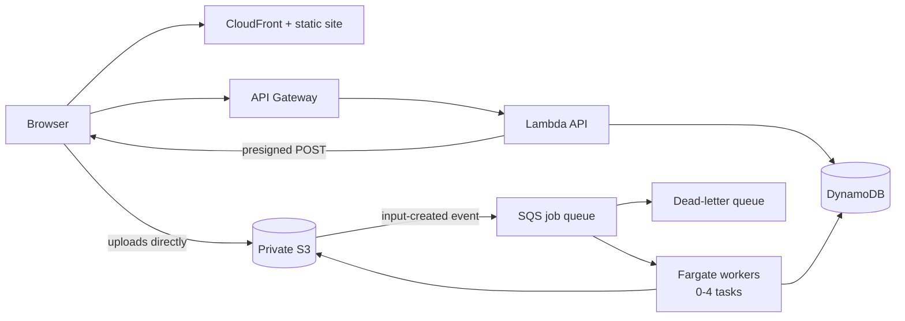

# Serverless migration runbook

How to roll the backend from "always-on ECS API + ALB" to "Lambda API + SQS +
scale-to-zero Fargate workers", and how to roll it back.

Every new resource is behind `enable_serverless` (default `false`) and the DNS
switch is behind `serverless_api_cutover` (default `false`), so the stack can be
provisioned and smoke-tested while production still runs on the old path.

## What changes

Before: the browser POSTs a multipart file to an ECS-hosted FastAPI container
behind an ALB, which processes the sheet in a background thread on that same
container. The container, the ALB, and three public IPv4 addresses bill 24/7,
and a deployment or crash loses whatever was queued in memory.

After:



The API never touches PDF bytes: it hands the browser a presigned POST to upload
with, and presigned GETs to read results with. That also sidesteps API Gateway's
10 MB request limit.

## Preconditions

- [ ] `infra/*.tf` is committed and `terraform plan` reports no unexpected drift.
- [ ] Terraform state has moved to the private S3 backend: apply
      `infra/state-bootstrap/`, then copy `backend.tf.example` to `backend.tf`
      and `backend.hcl.example` to `backend.hcl`, then
      `terraform init -backend-config=backend.hcl -migrate-state`.
- [ ] `alert_email` is set in your tfvars. It subscribes a person to the
      CloudWatch alarm topic; leave it empty and every alarm publishes into a
      topic nobody is listening to. `budget_email` is separate and optional -
      set it only if you want Terraform to manage an AWS Budget as well.
- [ ] Baseline recorded: current job duration, failure rate, and monthly cost.

## 1. Build and push images, without deploying

Run the Release workflow via **workflow_dispatch with `deploy` unchecked**. That
builds and pushes both images and stops:

- `...:migration-<sha>` — the full worker image (Audiveris + PyMuPDF, `Dockerfile`).
- `...:api-migration-<sha>` — the lightweight Lambda image (`Dockerfile.api`).

The workflow asserts the API image never imports `pymupdf` or `run`. If that
assertion fails, a heavy dependency has leaked into the API path and the Lambda
cold start will pay for it. Copy both image URIs from the run summary.

## 2. Provision the stack alongside production

```bash
cp infra/serverless.tfvars.example infra/serverless.tfvars
```

Fill in both image URIs, set `enable_serverless = true`, leave
`serverless_api_cutover = false`, then:

```bash
terraform -chdir=infra apply -var-file=serverless.tfvars
```

Two things to know about this apply:

- It creates a **new** bucket (`better-music-sheet-v2-files-<account>`). Existing
  sheets stay in the legacy bucket and are still served from it — `storage.py`
  reads each job's `storage_version` and picks the matching key layout, so old
  history keeps working. There is no data migration.
- It applies a CORS configuration to the **legacy** bucket so the browser can
  read old sheets directly after cutover. If that bucket already has CORS rules,
  merge them into `modules/serverless/storage.tf` first — this resource replaces
  the whole configuration rather than adding to it.

The ECS worker service is created with `desired_count = 0` and
`ignore_changes = [desired_count]`, because the controller Lambda owns that
number from here on.

## 3. Confirm the alarm subscription

AWS emails a confirmation link to `alert_email`. Until someone clicks it, the
subscription sits in "pending confirmation" and every alarm is silently dropped.
Verify it took:

```bash
aws sns list-subscriptions-by-topic --topic-arn "$(terraform -chdir=infra output -raw serverless_alerts_topic)"
```

`SubscriptionArn` must be a real ARN, not the literal `PendingConfirmation`.

The mail is from `no-reply@sns.amazonaws.com`, subject "AWS Notification -
Subscription Confirmation", and the link is plain blue link text reading
"Confirm subscription" rather than a button. **It lands in Gmail's spam folder** -
search `from:no-reply@sns.amazonaws.com` rather than assuming it never arrived.
The token expires after three days; SNS console -> the topic -> Subscriptions ->
the pending row -> "Request confirmation" sends a fresh one.

## 4. Smoke-test the temporary URL

`terraform output serverless_api_url` gives an `execute-api` URL that is live
before any DNS change. Against it, confirm:

- [ ] `GET /api/health` returns 200.
- [ ] A guest upload completes end to end: `POST /api/uploads` → presigned POST
      to S3 → `POST /api/uploads/{job_id}/complete` → status polls to `done`.
- [ ] The controller wakes a worker from zero. The first job after an idle
      period waits ~1–3 minutes for task start plus image pull; the UI shows
      "Waiting for a recognition worker" throughout.
- [ ] `GET /api/sheets/{job_id}/assets` returns presigned URLs, and both the
      annotated PDF and `timeline.json` download from them.
- [ ] An **existing** pre-migration sheet still views, plays, downloads, and
      deletes. This is the main backward-compatibility risk.
- [ ] A deliberately bad input (an encrypted PDF) reaches `failed` with a
      readable message instead of retrying forever.
- [ ] A signed-in upload works, and one user cannot read another user's job.

Recovery behaviour — duplicate delivery, expired leases, upload-size mismatch,
reused upload URLs — is covered by `tests/test_serverless.py`, so this manual
pass is about the live AWS wiring rather than the logic.

## 5. Point the release workflow at the new stack

Publishing a release always deploys - that does not change during the
migration. `SERVERLESS_READY` decides only *which* stack it deploys to, so a
release cut before this step still updates the ECS API exactly as it does today.

Set the three addresses from `terraform output` **first**:

| Variable | Value |
| --- | --- |
| `API_LAMBDA_FUNCTION` | `serverless_api_function` |
| `CONTROLLER_LAMBDA_FUNCTION` | `serverless_controller_function` |
| `WORKER_ECS_SERVICE` | `serverless_worker_service` |

Then flip the switch:

| Variable | Value |
| --- | --- |
| `SERVERLESS_READY` | `true` |

Preflight fails fast if the switch is on while the three addresses are missing,
so a release cannot land in a half-provisioned stack. Both images are built on
every release regardless of the target, which is why the API image is already in
ECR when you provision.

### Merge the migration branch here, not earlier

**This is the step to merge to `master`, immediately after flipping the switch.**

The migration's backend requires `JOB_CONTROL_TABLE` and `NEW_JOB_FILES_BUCKET`,
which the long-running ECS API's task definition does not set. Merge before this
point and the next release deploys that code onto the ECS API, where every
upload fails with `KeyError: 'JOB_CONTROL_TABLE'` at the reservation step - while
DNS is still pointing at it.

With `SERVERLESS_READY` already `true`, `deploy-legacy` is skipped, so the ECS
API keeps serving its current image untouched until DNS moves in step 6. It
stops receiving new releases from that moment, which is the intended direction of
travel and is why this step comes before the cutover rather than after it.

## 6. Cut DNS over

```bash
terraform -chdir=infra apply -var-file=serverless.tfvars -var serverless_api_cutover=true
```

This repoints the `api.bettermusicsheet.com` A record from the ALB to the API
Gateway custom domain. The ALB and the old ECS service stay up, untouched.

### Deploy the frontend in the same change window

**The compatibility only runs one way, and getting this wrong takes uploads
down.** The new bundle tolerates an old backend - it tries `/api/uploads` and
falls back to the legacy multipart `POST /api/sheets` on a 404, and falls back
from `/api/sheets/{id}/assets` to the streaming download the same way (see
`lib/sheet-files.ts`). The **old** bundle has no such fallback: it only knows
the legacy endpoint, which the new backend answers with a 409 telling the user
to refresh the page. Refreshing does not help - a static export is cached by
CloudFront, so the browser just fetches the same old JavaScript again.

So the static site must be rebuilt and deployed, not merely left alone:

```bash
cd better_music_sheet_web
NEXT_PUBLIC_API_BASE=https://api.bettermusicsheet.com NEXT_PUBLIC_COGNITO_REGION=us-west-1 NEXT_PUBLIC_COGNITO_CLIENT_ID=<cognito_app_client_id> npm run build
aws s3 sync out/ s3://better-music-sheet-web/ --delete
aws cloudfront create-invalidation --distribution-id <id> --paths '/*'
```

Check the build before shipping it: `grep -rl localhost out/` must find nothing,
since `.env.local` points at a dev server and a stray hit means the production
bundle is calling localhost.

A release does this automatically in `deploy-ui`. Cutting DNS over without one
does not, which is the failure worth remembering: every API-level smoke test
passes while the browser is broken, because curl never loads the bundle.

## 7. Watch, and how to roll back

For the first day, watch the alarms and the controller log:

```bash
aws logs tail /better-music-sheet-v2/controller --follow
```

It prints one JSON line per minute with `visible`, `inflight`, and `desired`.

**Rollback has two halves, both one-liners.** Traffic: re-apply with
`serverless_api_cutover=false`, and DNS returns to the ALB with the old service
still running and no database migration to undo. Deployments: set
`SERVERLESS_READY` back to `false`, so the next release updates the ECS API
again instead of the Lambda and worker. Jobs already in SQS finish on the new workers; jobs
submitted after the revert take the old path.

What the alarms mean:

| Alarm | Meaning |
| --- | --- |
| `queue-age` | Oldest message older than 10 min — workers are stuck or not scaling. |
| `dlq` | A message exhausted its redrive limit. The controller drains the DLQ and only fails a job after three real processing attempts. |
| `api-errors` / `controller-errors` | Unhandled Lambda exceptions. |
| `worker-cap` | Pinned at `serverless_max_workers` for 10 minutes — backlog is outrunning the cap. Raise it deliberately, with the cost in mind. |

## 8. Decommission the old path

Only after a quiet rollback window (a few days is reasonable), delete the ECS
API service, the ALB, its target group and listeners, and the now-unused
security groups. That is what removes the bulk of the fixed monthly cost: the
always-on container, the ALB, and three billed public IPv4 addresses.

Keep the ECS **cluster** — the workers run in it.

## 9. Later: Spot burst

Once queue recovery and idempotency have been proven in production, set
`serverless_spot_burst = true`. The first worker stays on regular Fargate;
additional burst workers prefer Spot. An interrupted Spot task's job returns to
SQS and is retried by another worker — exactly the path the lease and
conditional-claim logic already exercises. Do not enable this before step 7 has
run clean.

## Reference

**Knobs** (`infra/serverless.tfvars`): `enable_serverless`,
`serverless_api_image`, `serverless_worker_image`, `serverless_api_cutover`,
`serverless_max_workers` (1–16, default 4), `serverless_spot_burst`,
`alert_email`, `budget_email`.

**Why 4 workers.** The account's regional Fargate quota allows far more, but
each worker is 2 vCPU / 4 GB, and an unexpected upload burst at a higher cap
turns directly into an unexpected bill.

**Why a queue rather than Lambda for recognition.** Audiveris runs long, and a
difficult or retried sheet can exceed Lambda's 15-minute ceiling. The API is
Lambda-sized; recognition is not.

**Durability.** A job is safe once its bytes are in S3: the S3 notification is
at-least-once, the worker claims jobs with a conditional DynamoDB update, and
the scheduled controller re-enqueues anything a lost notification or a crashed
worker left behind. Duplicate delivery produces one result, not two.
